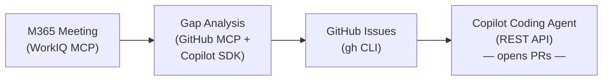

# Meeting → Code

> Turn meeting decisions into shipped code — automatically.

**Meeting → Code** is a demonstrator showing how the [GitHub Copilot SDK](https://github.com/github/copilot-sdk), [Microsoft WorkIQ](https://www.microsoft.com/en-us/microsoft-365/blog/2025/05/19/from-information-to-action-introducing-microsoft-365-workiq/), and the GitHub platform work together to close the loop from a conversation in a meeting to running code in a repository.


---

## What It Does

The app walks through a three-step pipeline, fully streamed to the browser in real time:

| Step | What happens | Powered by |
|------|-------------|------------|
| **1. Extract** | Retrieves notes/transcript from a Microsoft 365 meeting and extracts actionable requirements | WorkIQ MCP + Copilot SDK |
| **2. Analyze & Create** | Compares each requirement against the target repo's codebase, identifies gaps, and creates GitHub Issues | GitHub MCP + Copilot SDK + `gh` CLI |
| **3. Assign & Ship** | Assigns the Copilot coding agent (`copilot-swe-agent`) to each issue so it opens PRs automatically | GitHub REST API |



## Architecture

```
meeting-2-code/
├── src/
│   ├── server.ts                 # Express server with SSE streaming endpoints
│   └── agents/
│       ├── session-helpers.ts    # Copilot SDK session wrapper (auto-approve permissions)
│       ├── gap-analyzer.ts       # Phase 1 & 2: WorkIQ meeting extraction + codebase gap analysis
│       ├── github-issues.ts      # Phase 3: Issue creation via gh CLI
│       └── coding-agent.ts       # Phase 4: Copilot agent assignment via GitHub REST API
├── public/
│   ├── index.html                # Single-page app
│   ├── app.js                    # Frontend logic with SSE consumers
│   └── styles.css                # Glass morphism dark theme
├── package.json
└── tsconfig.json
```

### Key Technologies

- **[GitHub Copilot SDK](https://github.com/github/copilot-sdk)** — Creates AI agent sessions that orchestrate tool calls via MCP servers. Used for meeting extraction (WorkIQ) and codebase gap analysis (GitHub MCP).
- **[Microsoft WorkIQ MCP](https://www.npmjs.com/package/@microsoft/workiq)** — Model Context Protocol server that connects to Microsoft 365 data (calendars, meetings, transcripts).
- **[GitHub MCP](https://docs.github.com/en/copilot/customizing-copilot/copilot-extensions/building-copilot-extensions/building-mcp-servers-for-copilot)** — Remote MCP server for reading repository contents, searching code, and browsing file trees.
- **[GitHub CLI (`gh`)](https://cli.github.com/)** — Used for issue creation and REST API calls for Copilot coding agent assignment.
- **[Copilot Coding Agent](https://docs.github.com/en/copilot/using-github-copilot/using-copilot-coding-agent)** — Autonomous agent (`copilot-swe-agent[bot]`) that reads issues and opens pull requests with implementation code.

## Prerequisites

| Requirement | Details |
|------------|---------|
| **Node.js** | v22 or later |
| **GitHub CLI** | Authenticated — run `gh auth login` |
| **GitHub Copilot** | Active subscription with Copilot SDK access |
| **Microsoft 365** | Account with WorkIQ access and a meeting titled *"Contoso Industries Redesign"* containing notes/transcript |
| **Target repo** | A GitHub repository to analyze (defaults to `danielmeppiel/corporate-website`) |

## Getting Started

```bash
# Clone
git clone https://github.com/danielmeppiel/meeting-2-code.git
cd meeting-2-code

# Install dependencies
npm install

# Start the server
npm start
```

Open **http://localhost:3000** in your browser.

### Changing the Target Repository

The target repo is configured in the agent files. Update the `OWNER` and `REPO` constants in:

- [`src/agents/github-issues.ts`](src/agents/github-issues.ts)
- [`src/agents/coding-agent.ts`](src/agents/coding-agent.ts)
- The codebase analysis prompt in [`src/agents/gap-analyzer.ts`](src/agents/gap-analyzer.ts)

## How It Works

1. **Click "Analyze Meeting"** — The app creates a Copilot SDK session connected to the WorkIQ MCP server, retrieves the meeting, and extracts requirements. A second session connects to the GitHub MCP server and performs a gap analysis against the target repository for each requirement. Results stream to the UI in real time via Server-Sent Events.

2. **Select gaps → "Create Issues"** — For each selected gap, the app runs `gh issue create` to open a detailed GitHub Issue with description, acceptance criteria, and effort estimate.

3. **Select issues → "Assign Copilot"** — The app calls the GitHub REST API to assign `copilot-swe-agent[bot]` to each issue. The coding agent then autonomously creates branches and opens pull requests.

## Development

```bash
# Watch mode (auto-restart on changes)
npm run dev

# Type-check
npm run build
```

## License

[MIT](LICENSE)
