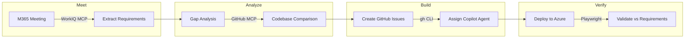

# Meeting → Code — Documentation

## Problem → Solution

**Problem:** Decisions made in meetings rarely translate directly into shipped code. There's a manual, error-prone chain: someone takes notes, another person files issues, a developer picks them up days later, and context is lost at every handoff.

**Solution:** Meeting → Code automates the entire chain. It connects to Microsoft 365 via WorkIQ to extract actionable requirements from any meeting, performs AI-powered gap analysis against the target repository using GitHub MCP, creates detailed GitHub Issues, and dispatches the Copilot coding agent to implement changes autonomously — all streamed to the browser in real time.

---

## Prerequisites

| Requirement | Details |
|------------|---------|
| **Node.js** | v22 or later |
| **GitHub CLI** | Installed and authenticated (`gh auth login`) |
| **GitHub Copilot** | Active subscription with Copilot SDK access |
| **Microsoft 365** | Account with WorkIQ access (for meeting extraction) |
| **Target repo** | A GitHub repository you own (for issue creation and agent assignment) |

### Optional (for deploy & validate steps)

| Requirement | Details |
|------------|---------|
| **Azure CLI + azd** | For Azure deployment (`az login`, `azd auth login`) |
| **Playwright** | Auto-installed — used for deployment validation |

---

## Setup

```bash
# 1. Clone the repository
git clone https://github.com/danielmeppiel/meeting-2-code.git
cd meeting-2-code

# 2. Install dependencies
npm install

# 3. Configure target repository (optional — defaults to danielmeppiel/corporate-website)
export TARGET_OWNER="your-github-username"
export TARGET_REPO="your-repo-name"
export TARGET_REPO_PATH="/path/to/local/clone"   # only needed for local agent mode

# 4. Start the server
npm start
```

Open **http://localhost:3000** in your browser.

### Environment Variables

| Variable | Default | Description |
|----------|---------|-------------|
| `TARGET_OWNER` | `danielmeppiel` | GitHub owner of the target repository |
| `TARGET_REPO` | `corporate-website` | Target repository name |
| `TARGET_REPO_PATH` | `~/Repos/<TARGET_REPO>` | Local clone path (for local agent mode) |
| `PORT` | `3000` | Server port |

---

## Deployment

The app itself runs locally as an Express server. It creates issues and dispatches work to a remote GitHub repository.

For the optional **Deploy & Validate** stage (Step 4), the target repo is deployed to Azure using `azd up`. This requires:

1. Azure CLI authenticated: `az login`
2. Azure Developer CLI authenticated: `azd auth login`
3. The target repo must have an `azure.yaml` configuration

---

## Architecture

```
┌─────────────────────────────────────────────────────────────────────────┐
│                          Browser (SPA)                                  │
│  ┌──────────┐  ┌──────────────┐  ┌──────────┐  ┌──────────────────┐   │
│  │   Meet   │→ │   Analyze    │→ │  Build   │→ │     Verify       │   │
│  │  (input) │  │ (gap table)  │  │ (issues) │  │ (deploy+validate)│   │
│  └──────────┘  └──────────────┘  └──────────┘  └──────────────────┘   │
│         ↕ SSE          ↕ SSE          ↕ SSE           ↕ SSE           │
└─────────────────────────────────────────────────────────────────────────┘
         ↕                ↕               ↕               ↕
┌─────────────────────────────────────────────────────────────────────────┐
│                     Express Server (src/server.ts)                      │
│  ┌────────────────┐ ┌───────────────┐ ┌──────────────┐ ┌────────────┐ │
│  │ gap-analyzer   │ │ github-issues │ │ coding-agent │ │ azure-     │ │
│  │ (Copilot SDK   │ │ (gh CLI)      │ │ (REST API)   │ │ deployer   │ │
│  │  + WorkIQ MCP  │ │               │ │              │ │ + playwright│ │
│  │  + GitHub MCP) │ │               │ │              │ │ validator  │ │
│  └────────────────┘ └───────────────┘ └──────────────┘ └────────────┘ │
└─────────────────────────────────────────────────────────────────────────┘
         ↕                                    ↕
┌──────────────────┐              ┌──────────────────────┐
│  WorkIQ MCP      │              │  GitHub Platform      │
│  (M365 meetings) │              │  - MCP (code search)  │
│                  │              │  - REST API (agents)   │
│                  │              │  - gh CLI (issues)     │
└──────────────────┘              └──────────────────────┘
```



### Key Components

| Component | File | Role |
|-----------|------|------|
| **Server** | `src/server.ts` | Express server with SSE streaming endpoints |
| **Session Helpers** | `src/agents/session-helpers.ts` | Copilot SDK session wrapper with auto-approve |
| **Gap Analyzer** | `src/agents/gap-analyzer.ts` | Meeting extraction (WorkIQ) + codebase gap analysis (GitHub MCP) |
| **GitHub Issues** | `src/agents/github-issues.ts` | Issue creation via `gh` CLI |
| **Epic Issue** | `src/agents/epic-issue.ts` | Epic creation and sub-issue linking |
| **Coding Agent** | `src/agents/coding-agent.ts` | Copilot agent (`copilot-swe-agent[bot]`) assignment via REST API |
| **Local Agent** | `src/agents/local-agent.ts` | Local Copilot SDK agent for direct code generation |
| **Azure Deployer** | `src/agents/azure-deployer.ts` | Azure deployment via `azd` |
| **Playwright Validator** | `src/agents/playwright-validator.ts` | Browser-based validation against requirements |
| **Config** | `src/config.ts` | Centralized environment-based configuration |

---

## Responsible AI (RAI) Notes

### Human-in-the-Loop Design

Meeting → Code is designed with human oversight at every stage:

- **Requirement review:** Extracted requirements are shown to the user before any action is taken. The user selects which requirements to analyze.
- **Gap approval:** After gap analysis, the user reviews and selects which gaps become GitHub Issues. No issues are created automatically.
- **Agent dispatch:** The user explicitly triggers Copilot agent assignment. The agent creates pull requests — not direct commits — so code is reviewed before merging.

### AI Usage & Limitations

- **Copilot SDK** orchestrates tool calls via MCP servers. It interprets meeting content and assesses code gaps. Results may be inaccurate or incomplete — the human review steps catch this.
- **No PII storage:** Meeting content is processed in-memory and streamed to the browser. It is not persisted to disk or any database.
- **Model selection:** Uses GPT models via the Copilot SDK. Model outputs can vary; the structured JSON parsing with fallbacks handles unexpected formats gracefully.

### Transparency

- All AI agent activity is logged in real-time in the browser's agent log panel.
- Every tool call made by the Copilot SDK session is surfaced to the user.
- GitHub Issues created by the tool are clearly labeled with their automated origin.
